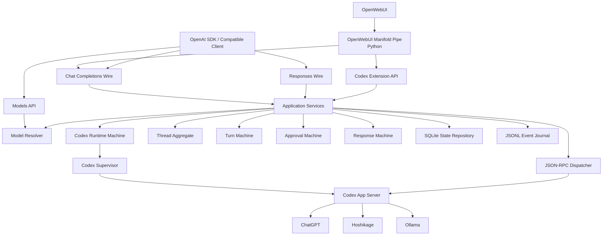

# Codex Hoshikage Proxy システム設計書

## 1. 文書情報

| 項目 | 内容 |
|---|---|
| 文書名 | Codex Hoshikage Proxy システム設計書 |
| プロジェクト名 | Codex Hoshikage Proxy |
| 文書種別 | システム設計書 |
| 対象フェーズ | MVP（段階実装） |
| 状態 | Draft |
| 対応要件 | `codex-hoshikage-proxy-requirements.md` |
| 想定公開先 | GitHub |
| Proxy実装言語 | Rust |
| OpenWebUI連携実装言語 | Python |
| 設定ルート | `~/.config/codex-hoshikage-proxy` |

---

## 2. 設計目的

本設計は、Codex App Server を常駐 Agent Runtime として利用し、外部へ OpenAI 互換 API を提供する Codex Hoshikage Proxy の内部構造を定義する。

本システムは、HTTP リクエストを順番に処理する巨大な Handler として実装しない。

本システムでは、外部副作用を伴うAgent Runtimeを、状態遷移の合成として記述する。`GameState`を中心に状態変化を組み立てる状態遷移型設計の考え方を、Runtime・Thread・Turn・Approval・Responseへ適用する。

以下を独立した構造として定義する。

- Provider
- Model
- Model Selection
- Reasoning Policy
- Codex Runtime
- Thread
- Turn
- Approval
- Response
- Event
- Transition
- Effect
- Persistence
- Wire Adapter

状態変化は手続きの途中で暗黙に発生させず、状態と観測イベントから導出される遷移として表現する。

```text
State + Event
      ↓
Transition
      ├─ Next State
      └─ Effects
```

副作用は状態機械の外側で実行する。

中心部のDomain Stateは不変スナップショットとして扱い、Domain State自身はProcess、Channel、Semaphore、DB接続などの資源を所有しない。

---

## 3. 設計思想

### 3.1 処理ではなく構造と状態遷移を記述する

本システムの核心は、以下の処理列を直接コード化することではない。

```text
HTTPを受信する
→ モデルを探す
→ Codexへ送る
→ stdoutを読む
→ Approvalを待つ
→ SSEへ変換する
```

代わりに、次の構造を定義する。

```text
Request Intent
+ Model Registry
+ Runtime State
+ Thread State
+ Turn State
+ Codex Event
= Transition + Effects
```

実装は、この構造を適用する Application Service によって構成する。

### 3.2 不正状態を型で表現不能にする

以下を単なる文字列や真偽値で表現しない。

- Provider ID
- Model ID
- Thread ID
- Turn ID
- Response ID
- Approval ID
- Sandbox Mode
- Approval Decision
- Runtime State
- Turn State
- Response State
- Error Code

例:

```rust
#[derive(Debug, Clone, PartialEq, Eq, Hash)]
pub struct PublicModelId(String);

#[derive(Debug, Clone, PartialEq, Eq, Hash)]
pub struct ThreadId(String);

#[derive(Debug, Clone, Copy, PartialEq, Eq)]
pub enum SandboxMode {
    ReadOnly,
    WorkspaceWrite,
    DangerFullAccess,
}
```

ProviderとModelは `ModelSelection` として一体に解決する。Reasoning Policyはそれとは独立して解決する。

```rust
pub enum ReasoningEffort {
    None,
    Low,
    Medium,
    High,
    XHigh,
    Max,
}

pub enum ApprovalCapability {
    None,
    Interactive,
}

pub struct ReasoningPolicy {
    pub effort: ReasoningEffort,
}
```

`ReasoningEffort` はChatGPT Providerにのみ適用する。非ChatGPT Providerでリクエストから明示された場合は `unsupported_parameter` とし、Codex内部の既定値が必要な場合だけ `Medium` を使用する。実際に許可する値はモデル定義のCapabilityで検証する。

### 3.3 状態と資源を分離する

純粋な状態値は、以下の OS 資源を直接所有しない。

- Child process
- stdin
- stdout
- Socket
- Semaphore permit
- SQLite connection
- File handle
- HTTP response body sender

状態遷移は `Effect` を返し、Application 層がそれを実行する。

```rust
pub struct Transition<S, E> {
    pub next: S,
    pub effects: Vec<E>,
}
```

Transitionは状態を直接変更する処理ではなく、`State + Event → Next State + Effects`を表す値である。EffectsはApplication層が実行し、実行結果は次のDomain Eventとして再び状態機械へ入力する。

```text
Immutable State
      ↓ observe
Read-only Query
      ↓ evaluate
Rule / Transition Generator
      ↓ produce
Transition(State' + Effects)
      ↓ apply effects outside Domain
Observed Event
```

複数の合法な遷移候補が存在する場合は、Ruleが候補を遅延生成する。HTTPリクエストやCodex Eventのように入力イベントから遷移が一意に定まる場合は、候補生成を経ず単一の純粋な遷移関数を適用する。すべてのケースでDomainが副作用を直接実行しないことを優先する。

### 3.4 Main と Handler を賢くしない

`main.rs` の責務は以下に限定する。

1. 設定を読む
2. Composition Root を構築する
3. Runtime を起動する
4. HTTP Server を起動する
5. Shutdown を待つ

HTTP Handler の責務は以下に限定する。

1. Wire DTO を受け取る
2. 検証済み Command へ変換する
3. Application Service を呼ぶ
4. Wire Response へ変換する

Handler に以下を置いてはならない。

- Provider 選択規則
- Model 解決規則
- Codex JSON-RPC の組み立て
- Turn 状態遷移
- Approval 状態遷移
- Retry 判定
- SQLite 操作
- Semaphore 操作
- Process 再起動
- SSE Event 順序制御

### 3.5 実在する変化軸だけを Trait にする

MVP で Trait とする境界は、複数実装が実在するものに限定する。

- `CodexTransport`
- `StateRepository`
- `EventJournal`
- `Clock`
- `IdGenerator`
- `ProviderPermitPool`
- `CodexProcess`
- `ApprovalPresenter` は Proxy 外部ではなく OpenWebUI 側の契約として扱う

単純な DTO 変換、値検証、状態遷移には不要な Trait を設けない。

### 3.6 安全性判断を Codex に一元化する

Proxy は Shell Command や File Operation の安全性を独自判定しない。

```text
Codex
  → Approval が必要か判断

Proxy
  → Approval Request を保持・中継

OpenWebUI
  → User Decision を取得

Proxy
  → Codex へ Decision を返す
```

Proxy に第二の Sandbox 判定器を作らない。

---

## 4. 全体アーキテクチャ



---

## 5. レイヤー構成

| レイヤー | 責務 |
|---|---|
| Wire | HTTP、JSON、SSE、OpenAI互換 DTO |
| Application | Use Case の組み立て、Effect 実行順序 |
| Domain | 状態、規則、遷移、検証済み値 |
| Codex Protocol | JSON-RPC Subset、Codex Event 正規化 |
| Runtime | Codex Process、Transport、Dispatcher |
| Persistence | SQLite、JSONL |
| Integration | OpenWebUI Pipe、Provider設定生成 |
| Infrastructure | Config、Clock、ID、Logging |

### 5.1 依存方向

```text
Wire
  ↓
Application
  ↓
Domain

Runtime Adapter
  → Domain Port

Persistence Adapter
  → Domain/Application Port
```

### 5.2 禁止依存

以下を禁止する。

- Domain から Axum への依存
- Domain から Tokio Process への依存
- Domain から SQLite への依存
- Runtime から HTTP Wire DTO への依存
- Handler から Child Process への直接操作
- Handler から SQL 発行
- OpenWebUI 固有型の Proxy Domain への侵入
- Provider 固有モデル名の Domain 規則へのハードコード

---

## 6. リポジトリ構成

```text
codex-hoshikage-proxy/
├── Cargo.toml
├── README.md
├── LICENSE
├── docs/
│   ├── requirements.md
│   ├── system-design.md
│   ├── api-spec.md
│   └── codex-compatibility.md
├── config/
│   ├── config.example.toml
│   └── config.schema.json
├── schemas/
│   └── codex-app-server/
│       ├── tested-version.txt
│       └── generated-json-schema/
├── openwebui/
│   ├── codex_hoshikage_proxy_pipe.py
│   └── README.md
├── src/
│   ├── main.rs
│   ├── bootstrap/
│   ├── config/
│   ├── domain/
│   ├── application/
│   ├── wire/
│   ├── codex_protocol/
│   ├── runtime/
│   ├── persistence/
│   ├── observability/
│   └── security/
└── tests/
    ├── fixtures/
    ├── fake_codex/
    ├── integration/
    └── compatibility/
```

---

## 7. Rust モジュール設計

```text
src/
├── main.rs
├── bootstrap/
│   ├── mod.rs
│   ├── composition_root.rs
│   └── shutdown.rs
│
├── config/
│   ├── mod.rs
│   ├── raw.rs
│   ├── validated.rs
│   ├── loader.rs
│   ├── codex_config_generator.rs
│   └── path_expansion.rs
│
├── domain/
│   ├── mod.rs
│   ├── ids.rs
│   ├── model/
│   │   ├── mod.rs
│   │   ├── provider.rs
│   │   ├── model.rs
│   │   ├── registry.rs
│   │   └── resolver.rs
│   ├── runtime/
│   │   ├── state.rs
│   │   ├── event.rs
│   │   ├── effect.rs
│   │   └── transition.rs
│   ├── thread/
│   │   ├── aggregate.rs
│   │   ├── state.rs
│   │   └── policy.rs
│   ├── turn/
│   │   ├── state.rs
│   │   ├── event.rs
│   │   ├── effect.rs
│   │   └── transition.rs
│   ├── approval/
│   │   ├── state.rs
│   │   ├── request.rs
│   │   ├── decision.rs
│   │   └── transition.rs
│   ├── response/
│   │   ├── state.rs
│   │   ├── event.rs
│   │   ├── projection.rs
│   │   └── transition.rs
│   └── error/
│       ├── code.rs
│       └── domain_error.rs
│
├── application/
│   ├── mod.rs
│   ├── chat_completion_service.rs
│   ├── responses_service.rs
│   ├── approval_service.rs
│   ├── model_query_service.rs
│   ├── runtime_service.rs
│   ├── event_query_service.rs
│   ├── effect_executor.rs
│   └── execution_context.rs
│
├── wire/
│   ├── mod.rs
│   ├── router.rs
│   ├── error.rs
│   ├── health.rs
│   ├── models.rs
│   ├── chat/
│   │   ├── dto.rs
│   │   ├── handler.rs
│   │   ├── adapter.rs
│   │   └── sse.rs
│   ├── responses/
│   │   ├── dto.rs
│   │   ├── handler.rs
│   │   ├── adapter.rs
│   │   └── sse.rs
│   └── codex_extension/
│       ├── approval.rs
│       └── events.rs
│
├── codex_protocol/
│   ├── mod.rs
│   ├── rpc.rs
│   ├── request.rs
│   ├── response.rs
│   ├── notification.rs
│   ├── approval.rs
│   ├── normalized_event.rs
│   └── compatibility.rs
│
├── runtime/
│   ├── mod.rs
│   ├── process.rs
│   ├── supervisor.rs
│   ├── stdio_transport.rs
│   ├── dispatcher.rs
│   ├── pending_requests.rs
│   ├── event_router.rs
│   ├── provider_permits.rs
│   └── runtime_handle.rs
│
├── persistence/
│   ├── mod.rs
│   ├── sqlite/
│   │   ├── connection.rs
│   │   ├── migration.rs
│   │   ├── response_thread_repository.rs
│   │   ├── turn_repository.rs
│   │   └── approval_repository.rs
│   └── jsonl/
│       ├── journal.rs
│       ├── writer.rs
│       └── reader.rs
│
├── observability/
│   ├── mod.rs
│   ├── tracing.rs
│   ├── context.rs
│   ├── metrics.rs
│   └── redaction.rs
│
└── security/
    ├── mod.rs
    ├── cwd_policy.rs
    ├── api_auth.rs
    └── secret.rs
```

---

## 8. Domain Model

### 8.1 識別子

```rust
pub struct PublicProviderId(String);
pub struct CodexProviderId(String);
pub struct PublicModelId(String);
pub struct UpstreamModelId(String);

pub struct RequestId(String);
pub struct ResponseId(String);
pub struct ThreadId(String);
pub struct TurnId(String);
pub struct ItemId(String);
pub struct ApprovalId(String);
pub struct RpcId(u64);
```

各識別子は以下を持つ。

- 検証済み生成
- 空文字列禁止
- `Display`
- `FromStr`
- Serde 境界変換
- ログ表示時の Redaction 方針

### 8.2 Provider

```rust
pub struct ProviderDefinition {
    pub public_id: PublicProviderId,
    pub codex_id: CodexProviderId,
    pub kind: ProviderKind,
    pub enabled: bool,
    pub max_concurrent_turns: NonZeroUsize,
}
```

```rust
pub enum ProviderKind {
    ChatGptBuiltin,
    OpenAiCompatible {
        base_url: Url,
        auth: ProviderAuth,
    },
}
```

### 8.3 Model

```rust
pub struct ModelDefinition {
    pub public_id: PublicModelId,
    pub provider_id: PublicProviderId,
    pub upstream_id: UpstreamModelId,
    pub display_name: String,
    pub default_cwd: Option<ValidatedPath>,
    pub reasoning_efforts: Vec<ReasoningEffort>,
    pub default_reasoning_effort: Option<ReasoningEffort>,
}
```

```rust
pub struct ModelSelection {
    pub public_model_id: PublicModelId,
    pub provider_id: PublicProviderId,
    pub upstream_model_id: UpstreamModelId,
}
```

```rust
pub struct ResolvedModel {
    pub public_model_id: PublicModelId,
    pub public_provider_id: PublicProviderId,
    pub codex_provider_id: CodexProviderId,
    pub upstream_model_id: UpstreamModelId,
    pub supported_reasoning_efforts: Vec<ReasoningEffort>,
}
```

ProviderとModelは `ModelSelection` として一体に解決し、Reasoning Policyは別の値として解決する。

### 8.4 Read-only Query

Domain RuleはAggregateやRegistryの内部Mapを直接操作しない。`WorldQuery`に相当する読み取り専用Queryを通じて、現在の状態を観測する。

```rust
pub struct RuntimeQuery<'a> {
    pub state: &'a CodexRuntimeState,
}

pub struct ThreadQuery<'a> {
    pub thread: &'a ThreadAggregate,
}

pub struct ModelRegistryQuery<'a> {
    pub registry: &'a ModelRegistry,
}
```

Queryは観測だけを担当し、状態変更やEffect実行を行わない。

### 8.5 Rule と Transition Generator

状態機械ごとのDomain Ruleは、入力されたEventを検証し、合法なTransitionだけを生成する。

```rust
pub type TransitionRule<S, I, E> =
    fn(&S, &I) -> Option<Transition<S, E>>;

pub struct TransitionGenerator<S, I, E> {
    pub rules: Vec<TransitionRule<S, I, E>>,
}
```

例えばApprovalでは、Codexが提示した `availableDecisions` とユーザー入力を照合するRuleがTransitionを生成する。Turnでは、`ApprovalRequested`、`CodexTurnCompleted`、`ClientDisconnected`などのEventに応じて次状態とEffectを生成する。

Application ServiceはRuleの内部条件を知らず、Transitionを適用してEffect Executorへ渡すだけにする。

---

## 9. Model Registry と Resolver

### 9.1 Registry

MVP の Model Registry は設定ファイルから構築した静的 Registry を基礎とし、起動時にProviderカタログで拡張する。

```rust
pub struct ModelRegistry {
    providers: HashMap<PublicProviderId, ProviderDefinition>,
    models: HashMap<PublicModelId, ModelDefinition>,
    default_model: PublicModelId,
}
```

### 9.2 Resolver 規則

```text
Requested Model
  ├─ None
  ├─ ""
  └─ "default"
       ↓
Default Model ID
       ↓
Model Definition
       ↓
Provider Definition
       ↓
Resolved Model
```

### 9.3 エラー

- Model 未登録: `model_not_found`
- Provider 未登録: 起動時設定エラー
- Provider disabled: `provider_unavailable`
- Default Model 不正: 起動時設定エラー
- 非対応Reasoning Effort: `unsupported_parameter`
- 非ChatGPT ProviderへのReasoning Effort指定: `unsupported_parameter`

### 9.4 Model Catalog Aggregator

MVPでは、静的Registryを基礎にProvider別のモデルカタログを起動時に統合する。

```text
Static Config
Hoshikage /v1/models
Ollama /api/tags
ChatGPT Codex model/list
        ↓
Model Catalog Aggregator
        ↓
Model Registry
        ↓
GET /v1/models / Model Resolver
```

静的定義を優先し、動的取得失敗はProvider単位で隔離する。MVPでは定期更新や専用Indexは設けない。

---

## 10. Codex Runtime 状態機械

### 10.1 状態

```rust
pub enum CodexRuntimeState {
    Stopped,
    Starting {
        attempt: u32,
    },
    Initializing {
        process_id: ProcessId,
    },
    Ready {
        process_id: ProcessId,
        initialized_at: Timestamp,
    },
    Recovering {
        attempt: u32,
        last_error: RuntimeFailure,
    },
    ShuttingDown,
    Failed {
        error: RuntimeFailure,
    },
}
```

### 10.2 Event

```rust
pub enum CodexRuntimeEvent {
    StartRequested,
    ProcessSpawned(ProcessId),
    ProcessSpawnFailed(RuntimeFailure),
    InitializeSucceeded,
    InitializeFailed(RuntimeFailure),
    ProcessExited(ExitStatus),
    RestartDelayElapsed,
    ShutdownRequested,
    ShutdownCompleted,
}
```

### 10.3 Effect

```rust
pub enum CodexRuntimeEffect {
    SpawnProcess,
    SendInitialize,
    MarkReady,
    FailActiveTurns,
    ScheduleRestart(Duration),
    CloseTransport,
    StopProcess,
}
```

### 10.4 遷移例

```text
Stopped + StartRequested
→ Starting
+ SpawnProcess

Starting + ProcessSpawned
→ Initializing
+ SendInitialize

Initializing + InitializeSucceeded
→ Ready
+ MarkReady

Ready + ProcessExited
→ Recovering
+ FailActiveTurns
+ ScheduleRestart

Recovering + RestartDelayElapsed
→ Starting
+ SpawnProcess
```

### 10.5 不変条件

- `Ready` 以外では新規 Turn を開始しない
- `Initializing` 中に通常 JSON-RPC Request を送らない
- Process 世代を跨いで Pending RPC を再利用しない
- Runtime 再起動時に実行中 Turn を自動再送しない

---

## 11. Thread Aggregate

### 11.1 役割

Thread は以下を束ねる集約境界とする。

- Thread ID
- Session Kind
- Resolved Model
- cwd
- Sandbox
- 現在の Turn
- Codex Thread 永続性
- Response Chain

### 11.2 Session Kind

```rust
pub enum SessionKind {
    ChatCompletionEphemeral,
    ResponsesDurable,
}
```

### 11.3 Thread Policy

```text
Chat Completions
  → thread/start(ephemeral=true)

Responses 新規
  → thread/start(ephemeral=false)

Responses 継続
  → thread/resume
```

### 11.4 不変条件

- 一つの Thread で同時に複数 Active Turn を持たない
- Responses 継続時は元 Response と同じ Public Model ID を使用する
- Ephemeral Thread は `response_id → thread_id` 永続化対象外
- Durable Thread の会話本文は Proxy に重複保存しない

---

## 12. Turn 状態機械

### 12.1 状態

```rust
pub enum TurnState {
    Created,
    WaitingForProviderPermit,
    Starting,
    Running {
        started_at: Timestamp,
    },
    AwaitingApproval {
        approval_id: ApprovalId,
    },
    Completed {
        completed_at: Timestamp,
    },
    Failed {
        error: TurnFailure,
    },
    Interrupted,
    Cancelled,
}
```

### 12.2 Event

```rust
pub enum TurnEvent {
    Enqueued,
    ProviderPermitAcquired,
    CodexTurnStarted,
    AgentMessageDelta(String),
    ItemStarted(NormalizedItem),
    ItemCompleted(NormalizedItem),
    ApprovalRequested(ApprovalRequest),
    ApprovalAccepted,
    ApprovalDeclined,
    ApprovalExpired,
    ApprovalCancelled,
    CodexTurnCompleted(TurnUsage),
    CodexTurnFailed(TurnFailure),
    RuntimeLost,
    ClientDisconnected,
    InterruptRequested,
    CancelRequested,
}
```

### 12.3 Effect

```rust
pub enum TurnEffect {
    AcquireProviderPermit(PublicProviderId),
    StartCodexTurn,
    PublishResponseEvent(ResponseEvent),
    PersistTurnState,
    AppendCodexEvent(NormalizedCodexEvent),
    RegisterApproval(ApprovalRequest),
    ReplyToCodexApproval {
        rpc_id: RpcId,
        decision: ApprovalDecision,
    },
    ReleaseProviderPermit,
    CompleteResponse,
    FailResponse(TurnFailure),
    CancelCodexTurn,
}
```

### 12.4 主要遷移

```text
Created + Enqueued
→ WaitingForProviderPermit
+ AcquireProviderPermit

WaitingForProviderPermit + ProviderPermitAcquired
→ Starting
+ StartCodexTurn

Starting + CodexTurnStarted
→ Running
+ PersistTurnState

Running + AgentMessageDelta
→ Running
+ PublishResponseEvent
+ AppendCodexEvent

Running + ApprovalRequested
→ AwaitingApproval
+ RegisterApproval
+ PersistTurnState

AwaitingApproval + ApprovalAccepted
→ Running
+ ReplyToCodexApproval
+ PersistTurnState

AwaitingApproval + ApprovalDeclined
→ Failed
+ ReplyToCodexApproval(Decline)
+ FailResponse(ApprovalDenied)
+ ReleaseProviderPermit

AwaitingApproval + ApprovalExpired
→ Failed
+ ReplyToCodexApproval(Decline)
+ FailResponse(ApprovalTimeout)
+ ReleaseProviderPermit

AwaitingApproval + ApprovalCancelled
→ Cancelled
+ CancelCodexTurn
+ ReleaseProviderPermit

Running + CodexTurnCompleted
→ Completed
+ CompleteResponse
+ ReleaseProviderPermit

Running + RuntimeLost
→ Failed
+ FailResponse
+ ReleaseProviderPermit

Running + CancelRequested
→ Cancelled
+ CancelCodexTurn
+ ReleaseProviderPermit

AwaitingApproval + CancelRequested
→ Cancelled
+ CancelCodexTurn
+ ReleaseProviderPermit
```

### 12.5 不変条件

- Provider Permit なしで `StartCodexTurn` を実行しない
- Terminal State から別 State へ遷移しない
- Provider Permit は Terminal 遷移で必ず解放する
- Approval 待ち中は新しい Approval を同じ Turn に重ねない
- Runtime Lost 時に Turn を自動再送しない

---

## 13. Approval 状態機械

### 13.1 状態

```rust
pub enum ApprovalState {
    Pending {
        request: ApprovalRequest,
        available_decisions: Vec<ApprovalDecision>,
        expires_at: Timestamp,
    },
    Resolved {
        decision: ApprovalDecision,
        resolved_at: Timestamp,
    },
    Expired {
        expired_at: Timestamp,
    },
    Cancelled {
        cancelled_at: Timestamp,
    },
}
```

### 13.2 Decision

```rust
pub enum ApprovalDecision {
    Accept,
    AcceptForSession,
    Decline,
    Cancel,
}
```

利用可能な Decision は Codex の `availableDecisions` から決定する。

### 13.3 Event

```rust
pub enum ApprovalEvent {
    UserDecisionReceived(ApprovalDecision),
    TimeoutElapsed,
    TurnCancelled,
    RuntimeLost,
}
```

Approval状態機械が確定した結果は、Turnへ意味を失わないOutcomeとして通知する。

```rust
pub enum ApprovalOutcome {
    Accepted,
    Declined,
    Expired,
    Cancelled,
}
```

### 13.4 Effect

```rust
pub enum ApprovalEffect {
    PersistState,
    ReplyToCodex(ApprovalDecision),
    NotifyTurn(ApprovalOutcome),
    RejectDuplicateDecision,
}
```

### 13.5 不変条件

- Codex が提示していない Decision を受理しない
- `Pending` 以外では Decision を受理しない
- 同じ Approval へ二回答しない
- Timeout 後の回答は拒否する
- Proxy は操作内容の安全性を独自判定しない

---

## 14. Response 状態機械

### 14.1 State

```rust
pub enum ResponseState {
    Created,
    Streaming,
    Aggregating,
    Completed,
    Failed {
        error: ProxyError,
    },
    Cancelled,
}
```

### 14.2 Projection

Codex Event から直接 Wire Event を生成しない。

一度 `ResponseEvent` へ正規化する。

```rust
pub enum ResponseEvent {
    Created,
    OutputTextDelta(String),
    ToolCallStarted(NormalizedToolCall),
    ToolCallCompleted(NormalizedToolResult),
    Completed(ResponseSummary),
    Failed(ProxyError),
}
```

### 14.3 Standard Projection

```text
Normalized Codex Event
      ↓
Response Event
      ├─ Chat Completions Projection
      └─ Responses Projection
```

### 14.4 独自イベント分離

Shell Progress、File Change、Approval、Subagent Event は標準 OpenAI Event へ混入しない。

それらは Event Journal と Extension API へ送る。

---

## 15. Codex Protocol Subset

### 15.1 方針

Codex App Server の全 Schema を Domain に取り込まない。

MVP が利用する Subset のみ手書き DTO として定義する。

### 15.2 必須 Request

- `initialize`
- `thread/start`
- `thread/resume`
- `turn/start`
- `turn/interrupt`
- Approval response

### 15.3 必須 Notification / Server Request

- `thread/started`
- `turn/started`
- `item/started`
- `item/completed`
- `item/agentMessage/delta`
- `turn/completed`
- Approval request
- Runtime/Protocol error

### 15.4 Compatibility Check

対応 Codex バージョンごとに以下を保存する。

```text
schemas/codex-app-server/
├── tested-version.txt
└── generated-json-schema/
```

CI では以下を実行する。

1. 対象 Codex から JSON Schema を生成
2. 保存済み Schema と比較

対応対象はCodex CLI `0.147.0` 以降とする。対象バージョンごとにJSON-RPC Fixtureと実機互換テストを保持する。
3. 使用 Subset に破壊的変更がある場合は失敗
4. 未使用領域の差分は警告

### 15.5 Version Policy

設定に以下を持つ。

```toml
[codex.compatibility]
minimum_version = "0.147.0"
tested_version = "0.147.0"
strict_upper_bound = false
```

- 最低バージョン未満: 起動拒否
- 検証済みより新しいバージョン: 警告
- `strict_upper_bound=true`: 未検証新バージョンを拒否

`minimum_version` と `tested_version` はPhase 0の互換性検証で更新可能だが、初期値は `0.147.0` とする。

---

## 16. JSON-RPC Dispatcher

### 16.1 構造

```rust
pub struct CodexDispatcher {
    writer: mpsc::Sender<OutboundRpc>,
    pending: DashMap<RpcId, PendingRequest>,
    turn_routes: DashMap<TurnId, mpsc::Sender<NormalizedCodexEvent>>,
    thread_routes: DashMap<ThreadId, mpsc::Sender<NormalizedCodexEvent>>,
    approval_routes: DashMap<RpcId, ApprovalRoute>,
    generation: RuntimeGeneration,
}
```

### 16.2 Reader Loop

Reader Loop は以下だけを行う。

1. stdout の一行を読む
2. JSON-RPC Envelope を parse
3. Response / Notification / Server Request を分類
4. Dispatcher へ渡す

状態変更、SQLite保存、SSE生成を Reader Loop に置かない。

### 16.3 Runtime Generation

Codex Process 再起動ごとに `RuntimeGeneration` を更新する。

旧世代の Response は破棄する。

```rust
pub struct RuntimeGeneration(u64);
```

### 16.4 Backpressure

- stdin writer は bounded channel
- Event route は bounded channel
- Queue saturation 時は `server_overloaded`
- 無制限 channel を使用しない

---

## 17. Provider Permit Pool

### 17.1 構造

```rust
pub struct ProviderPermitPool {
    semaphores: HashMap<PublicProviderId, Arc<Semaphore>>,
}
```

### 17.2 Permit

Permit は RAII で所有する。

```rust
pub struct ProviderTurnPermit {
    provider_id: PublicProviderId,
    permit: OwnedSemaphorePermit,
}
```

### 17.3 所有権

Permit は Active Turn Runtime が所有する。

Turn Terminal 遷移または Drop で解放する。

このPermitはProviderが実際に推論中かどうかではなく、Codex Turn全体のProvider枠を占有するTurn-lifetime permitである。Approval待ち中も保持する。Approval待ち中のPermit解放と再取得はPhase 2候補とする。

### 17.4 Provider Default

- `hoshikage`: 1
- `ollama`: 1
- `chatgpt`: 設定値

---

## 18. Application Services

### 18.1 ChatCompletionService

責務:

1. Chat Wire Input を正規化
2. Model を解決
3. cwd と Sandbox を検証
4. Ephemeral Thread Command を生成
5. Turn を実行
6. Chat Projection を返す

### 18.2 ResponsesService

責務:

1. Responses Wire Input を正規化
2. Model を解決
3. 新規または継続 Thread を決定
4. 継続時 Model 一致を検証
5. Durable Thread を開始または resume
6. Response ID を生成
7. Turn を実行
8. 対応情報を保存
9. Responses Projection を返す

### 18.3 ApprovalService

責務:

1. Approval 状態を取得
2. Decision を検証
3. Approval Transition を適用
4. Codex へ Decision を返す
5. Turn へ解決 Event を通知

### 18.4 RuntimeService

責務:

- Runtime 状態照会
- Start / Shutdown
- Health / Readiness
- Recovery 操作

### 18.5 ModelQueryService

責務:

- `/v1/models`
- Default Model 表示
- enabled Model のみ返却

Application ServiceはDomain Ruleの実装者ではない。ServiceはWire入力を検証済みIntentへ変換し、対象AggregateのQueryを構築し、純粋なTransitionを適用し、返されたEffectsをEffect Executorへ渡す。

```text
Wire DTO
  ↓ normalize
Command / Intent
  ↓ observe
Query + Domain State
  ↓ evaluate
Rule → Transition
  ↓ execute outside Domain
Effects → Domain Events
```

Serviceに、Provider固有分岐、Turn状態の直接変更、SQLite操作、Codex stdoutの解釈、SSE順序制御を集約してはならない。

---

## 19. Effect Executor

### 19.1 目的

Domain Transition が返す Effect を実行する。

```rust
pub struct EffectExecutor {
    codex: Arc<CodexRuntimeHandle>,
    state_repo: Arc<dyn StateRepository>,
    event_journal: Arc<dyn EventJournal>,
    permit_pool: Arc<ProviderPermitPool>,
    response_bus: Arc<ResponseBus>,
}
```

### 19.2 原則

- Effect の実行順序を明示する
- Effect 失敗を Domain Event へ戻す
- Effect 内で Domain State を直接書き換えない
- 再試行可能性を Effect 型ごとに定義する
- 副作用重複を避けるため idempotency key を持つ
- Effect実行後の状態確定は、実行結果をDomain EventとしてTransitionへ戻す
- Effect Executorは状態機械の代替にならず、Transitionの副作用を実行するだけにする

### 19.3 自動再試行

自動再試行を許可するのは、副作用を持たない操作に限定する。

例:

- Health check
- Read-only state query

自動再試行しない:

- `turn/start`
- Shell 実行を伴う Turn
- Approval response
- File Edit を伴う Turn

---

## 20. Persistence

### 20.1 方針

```text
SQLite
  → 状態・索引・対応関係

JSONL
  → Codex Event 原文・正規化イベント
```

### 20.2 SQLite Tables

#### response_threads

```sql
CREATE TABLE response_threads (
    response_id      TEXT PRIMARY KEY,
    thread_id        TEXT NOT NULL,
    public_model_id  TEXT NOT NULL,
    created_at       TEXT NOT NULL
);
```

#### turns

```sql
CREATE TABLE turns (
    turn_id            TEXT PRIMARY KEY,
    thread_id          TEXT NOT NULL,
    public_model_id    TEXT NOT NULL,
    provider_id        TEXT NOT NULL,
    state              TEXT NOT NULL,
    event_journal_path TEXT,
    created_at         TEXT NOT NULL,
    updated_at         TEXT NOT NULL
);
```

#### approvals

```sql
CREATE TABLE approvals (
    approval_id         TEXT PRIMARY KEY,
    rpc_id              INTEGER NOT NULL,
    thread_id           TEXT NOT NULL,
    turn_id             TEXT NOT NULL,
    state               TEXT NOT NULL,
    available_decisions TEXT NOT NULL,
    request_json        TEXT NOT NULL,
    decision            TEXT,
    expires_at          TEXT NOT NULL,
    created_at          TEXT NOT NULL,
    resolved_at         TEXT
);
```

### 20.3 JSONL Layout

```text
~/.config/codex-hoshikage-proxy/state/
├── proxy.sqlite3
└── events/
    └── <thread-id>/
        └── <turn-id>.jsonl
```

### 20.4 JSONL Record

```json
{
  "sequence": 12,
  "timestamp": "2026-01-01T00:00:00Z",
  "thread_id": "thread_x",
  "turn_id": "turn_x",
  "kind": "command.started",
  "payload": {}
}
```

### 20.5 書き込み原則

- 追記専用
- Sequence 単調増加
- 一行一 Event
- Partial line は復旧時に破棄可能
- Secret Redaction 後に保存
- 日次またはサイズ上限でローテーションする
- 保持期間を設定可能とする
- 既定ではmetadata中心とし、Shell出力・ファイル内容はサイズ制限とredactionを適用する
- MVPでは専用Indexを設けず、JSONLと標準CLIツールで検索する

---

## 21. OpenAI Wire Adapter

### 21.1 Chat Completions Adapter

入力:

```text
messages[]
model
stream
metadata
```

内部 Command:

```rust
pub struct StartChatCompletion {
    pub model: Option<String>,
    pub conversation: ConversationInput,
    pub stream: bool,
    pub approval_capability: ApprovalCapability,
    pub cwd: Option<String>,
}
```

### 21.2 Responses Adapter

入力:

```text
input
previous_response_id
model
stream
metadata
```

内部 Command:

```rust
pub struct StartResponse {
    pub model: Option<String>,
    pub input: ResponseInput,
    pub previous_response_id: Option<ResponseId>,
    pub stream: bool,
    pub reasoning: Option<ReasoningPolicy>,
    pub approval_capability: ApprovalCapability,
    pub cwd: Option<String>,
}
```

### 21.3 標準外フィールド

`metadata["codex.cwd"]` のみ MVP で解釈する。

その他 metadata は透過保存または無視を設定可能とする。

Responsesの `reasoning.effort` は、ChatGPT Providerかつ選択モデルのCapabilityが許可する場合のみ上流へ投影する。非ChatGPT Providerで明示された場合は `unsupported_parameter` としてWireエラーへ変換する。Codex内部で既定値だけが必要な場合は `medium` を設定する。

Approval capabilityは標準OpenAIフィールドへ混入させず、Proxy内部のRequest Contextへ正規化する。OpenWebUI Pipeは `metadata["codex.approval_capability"] = "interactive"` を付与し、それ以外は `None` とする。

Approval Request発生時、非StreamingまたはSSEヘッダー送信前であればCleanup完了後にHTTP `409 approval_required`を返す。SSEヘッダー送信後はHTTP Statusを変更できないため、標準エラーイベントを配信してストリームを終了する。

本Proxyが提供するOpenAI互換APIは、完全互換ではなくOpenAI-compatible subsetとする。MVPのWire Adapterは以下を契約対象とする。

| API | MVP契約 |
|---|---|
| Chat Completions | `messages`, `model`, `stream`, `metadata`、標準的なtext/tool call/tool result/usage/finish reason/error/cancellation |
| Responses | `input`, `previous_response_id`, `model`, `stream`, `metadata`, `reasoning`（ChatGPTのみ）、標準的なtext/tool call/tool result/usage/finish reason/error/cancellation |

`tools`、`tool_choice`、Function Call、multimodal contentなどは、実装するフィールドをWire DTOとFixtureで個別に定義する。未対応または意味を安全に無視できないフィールドは、黙って無視せず `unsupported_parameter` を返す。

---

## 22. SSE 設計

### 22.1 Response Bus

Turn ごとに `ResponseBus` を生成する。

```rust
pub struct ResponseBus {
    subscribers: DashMap<ResponseId, ResponseSink>,
}
```

### 22.2 Chat SSE

- `data: {json}`
- 完了時 `data: [DONE]`
- 独自 Codex Event を混入しない

### 22.3 Responses SSE

- `response.created`
- `response.output_text.delta`
- `response.completed`
- `response.failed`

### 22.4 Disconnect

クライアント切断時:

- Output subscriber を削除
- Turnへcancelを発行
- MVPではTurnを継続しない
- Approval待ち中も同じTurnへcancelを発行し、ApprovalをCancelledへ遷移させる

---

## 23. Codex Extension API

### 23.1 Approval

```http
GET /v1/codex/approvals/{approval_id}
POST /v1/codex/approvals/{approval_id}
```

Approval APIのWire DecisionはDomain Decisionへ明示的に変換する。

| Wire Decision | Domain Decision | Codex Decision |
|---|---|---|
| `accept` | `Accept` | `accept` |
| `accept_for_session` | `AcceptForSession` | `accept_for_session` |
| `decline` | `Decline` | `decline` |
| `cancel` | `Cancel` | `cancel` |

`availableDecisions`に含まれないWire Decisionは受理しない。Proxyは4値をYes / Noへ縮約しない。

### 23.2 Event Query

```http
GET /v1/codex/turns/{turn_id}/events
```

Pagination:

- `after_sequence`
- `limit`

### 23.3 Event Stream

```http
GET /v1/codex/turns/{turn_id}/events/stream
```

JSONL Journal の過去分を replay 後、live event を配信可能とする。

### 23.4 認証

Extension API は通常 API と同じ API Key Policy を使用する。

Loopback bindではAPI Keyを任意とし、非loopback bindでは単一API Keyを必須とする。認証情報がない非loopback起動はfail-closedとする。TLSはリバースプロキシへ委譲し、CORSは既定で無効とする。複数Keyと権限管理はPhase 2とする。

---

## 24. OpenWebUI Manifold Pipe 設計

### 24.1 正式経路

OpenWebUI から対話承認を利用する正式経路は Manifold Pipe とする。

通常 OpenAI Compatible Connection は互換経路として維持する。

### 24.2 models()

Pipe の `models()` は Proxy の `/v1/models` を呼び出し、以下のように表示する。

```text
Codex / ChatGPT / Example
Codex / Hoshikage / Example
Codex / Ollama / Example
```

内部 ID は Public Model ID を保持する。

### 24.3 pipe()

`pipe()` は以下を行う。

1. OpenWebUI Request を Proxy Chat Completions へ送信
2. SSE を読み取る
3. Text Delta を OpenWebUI へ送る
4. Extension Event Stream を監視
5. Approval Request を検出
6. `__event_call__` で Confirmation を表示
7. 選択結果を Approval API へ送信
8. 同じ Turn の継続を待つ

### 24.4 Approval UI

Codex の `availableDecisions` をそのまま UI 選択肢へ投影する。

固定の Yes / No に丸めない。

### 24.5 Pipe 障害

- Pipe停止・接続断時はProxy Turnへcancelを発行する
- Pending ApprovalはCancelledへ遷移する
- Provider Permitを解放し、再接続による同じTurnの継続は行わない
- OpenWebUI 固有状態を Proxy Domain へ保存しない

OpenWebUI PipeなどApproval capabilityを持たないクライアントでは、Approval Request発生時に待機せず `approval_required` を返す。自動承認は行わない。

ただし、HTTPエラーを先に返してCodex TurnをPendingのまま残してはならない。capabilityなしを検出した場合は、CodexへCancelを返し、ApprovalをCancelled、TurnをCancelledへ遷移させ、Provider Permitを解放した後に `approval_required` を返す。

---

## 25. Config 設計

### 25.1 RawConfig と ValidatedConfig

```text
TOML
 ↓
RawConfig
 ↓ validate
ValidatedConfig
```

Parse 失敗や検証失敗時に既定値へ黙って戻らない。

### 25.2 ルート

```text
~/.config/codex-hoshikage-proxy
```

環境変数:

```text
CODEX_HOSHIKAGE_PROXY_HOME
```

### 25.3 構造

```text
~/.config/codex-hoshikage-proxy/
├── config.toml
├── codex-home/
│   ├── config.toml
│   ├── auth.json
│   └── sessions/
└── state/
    ├── proxy.sqlite3
    └── events/
```

### 25.4 Codex Config Generator

Proxy の Provider 設定から専用 Codex `config.toml` を生成する。

生成対象:

- `model_providers`
- base URL
- auth env key
- retries

専用 `CODEX_HOME` はProxy管理領域とする。`config.toml`は宣言的設定から毎回再生成し、手編集はサポートしない。`auth.json`はProxyが生成せず、ユーザーがCodex標準の認証手順で用意する。

cwd Allowlistは型検証し、既定例は以下とする。

```toml
[security]
allowed_cwds = ["${HOME}/work", "${HOME}/projects"]
```

指定cwdは実在確認を行い、Proxyはディレクトリを作成しない。
- stream timeout
- Responses wire
- default provider/model は Proxy Request で上書きされるため補助値

### 25.5 生成ファイル所有権

生成された Codex Config は Proxy 管理下とする。

ユーザー手書き領域を混在させない。

---

## 26. cwd Security

### 26.1 Value Object

```rust
pub struct ValidatedCwd {
    absolute: PathBuf,
}
```

### 26.2 検証

- 絶対パス
- 正規化可能
- 設定された workspace root 内
- NUL なし
- Path Traversal 解消後に再検証
- 必要に応じて存在・Directory 確認

### 26.3 優先順位

```text
request.metadata["codex.cwd"]
→ model.default_cwd
→ server.default_cwd
```

---

## 27. Error Model

### 27.1 内部 Error

```rust
pub enum ProxyError {
    InvalidRequest,
    InvalidCwd,
    ModelNotFound,
    ResponseNotFound,
    ThreadNotFound,
    ModelChangeNotAllowed,
    ApprovalDenied,
    ApprovalTimeout,
    ProviderUnavailable,
    CodexNotReady,
    ServerOverloaded,
    UpstreamTimeout,
    TurnFailed,
    CodexProcessTerminated,
    Internal,
}
```

### 27.2 属性

各 Error は以下を持つ。

```rust
pub struct ErrorDescriptor {
    pub code: &'static str,
    pub http_status: StatusCode,
    pub retryable: bool,
    pub param: Option<&'static str>,
    pub safe_message: &'static str,
}
```

### 27.3 Wire Projection

Chat / Responses / Extension API で同一の内部 Error を使用する。

---

## 28. Observability

### 28.1 Context

```rust
pub struct ExecutionContext {
    pub request_id: RequestId,
    pub response_id: Option<ResponseId>,
    pub thread_id: Option<ThreadId>,
    pub turn_id: Option<TurnId>,
    pub provider_id: Option<PublicProviderId>,
    pub model_id: Option<PublicModelId>,
}
```

### 28.2 Structured Logging

最低限:

- request_id
- response_id
- thread_id
- turn_id
- approval_id
- provider_id
- model_id
- runtime_generation
- transition
- error_code

### 28.3 Redaction

既定で記録しない:

- User input 本文
- Assistant output 本文
- Shell output 全文
- File diff 全文
- Authorization
- Token
- Cookie

詳細ログは明示設定時のみ。

---

## 29. Health と Readiness

### 29.1 `/healthz`

Proxy Process 自体が生存し、Event Loop が動作していれば 200。

### 29.2 `/readyz`

以下をすべて満たす場合のみ 200。

- Config valid
- SQLite ready
- Event Journal writable
- Codex Runtime `Ready`
- Dispatcher active

Provider の一部停止は readiness 全体を落とさず、Model 単位で unavailable とする。

---

## 30. Shutdown

### 30.1 順序

1. 新規 HTTP Request 受付停止
2. 新規 Turn 受付停止
3. Active Turn に grace period
4. 残存 Turn interrupt
5. Event Journal flush
6. SQLite checkpoint
7. Codex App Server shutdown
8. Process 終了

### 30.2 不変条件

- Journal flush 前に Process を終了しない
- Pending Approval を曖昧な状態で残さない
- Permit を解放する
- Pending RPC を failure で完了させる
- Approval capabilityなしのHTTPエラー返却前に、CodexへのCancelとTurn/PermitのCleanupを完了する

---

## 31. Testing Design

### 31.1 Pure Transition Test

各状態機械は副作用なしにテスト可能とする。

```rust
#[test]
fn approval_timeout_moves_pending_to_expired() {
    // State + Event -> Next State + Effects
}
```

追加で以下を検証する。

- Transition適用前の入力Stateが変更されない
- QueryがState、Repository、Effectを変更しない
- 不正なEventはTransitionを生成しない
- Ruleが生成したEffectにOS資源やHTTP Bodyを含めない
- 複数の合法な遷移候補を遅延生成できる
- Terminal StateからTransitionが生成されない

### 31.2 Characterization Test

Codex App Server の実際の Wire 挙動を Fixture として固定する。

### 31.3 Fake Codex Runtime

Fake は Scripted Event Sequence を返す。

```rust
pub struct CodexScenario {
    pub expected_requests: Vec<ExpectedRpc>,
    pub emitted_messages: Vec<ScheduledRpcMessage>,
}
```

### 31.4 Integration Test

- Chat Streaming
- Responses Streaming
- Durable Resume
- Approval Round Trip
- ApprovalDeclined / ApprovalExpired / ApprovalCancelled Turn遷移
- Approval capabilityなし時のCancel・Permit解放・`approval_required`
- Runtime Restart
- Provider Semaphore
- Pipe Confirmation
- JSONL Replay
- SQLite Recovery

### 31.5 Property Test

対象:

- Terminal State から遷移しない
- Approval 二重回答不可
- Permit leak なし
- Sequence 単調増加
- Model Resolver 一意性
- Immutable Stateの入力・出力分離
- Rule追加時に既存Ruleの順序と結果が不変であること

---

## 32. Implementation Phases

### Phase 0: Contract Freeze

- 要件定義 Draft
- システム設計 Draft
- Codex tested version 固定
- JSON Schema 保存
- Fake Codex fixture 作成

### Phase 1: Runtime Spine

- Config
- Codex Process
- stdio Transport
- initialize
- Dispatcher
- Runtime Machine
- healthz / readyz

### Phase 2: Responses Single Turn Vertical Slice

- Static Model Registry
- Responses API
- Durable Threadの基本構造
- Turn Machine
- Non Streaming
- Hoshikage Provider

### Phase 3: Streaming

- Response Machine
- Responses SSE
- Event Journal

### Phase 4: Durable Responses

- SQLite
- `response_id → thread_id`
- thread/resume
- Model change rejection

### Phase 4.5: Chat Completions

- Chat Completions
- Ephemeral Thread
- Chat SSE

### Phase 5: Multi Provider

- ChatGPT
- Ollama
- Provider Permit Pool
- Codex Config Generator
- Provider Model Catalog Aggregator
- `GET /v1/models`

### Phase 6: Approval

- Approval Machine
- Approval API
- availableDecisions
- Timeout
- Duplicate protection

### Phase 7: OpenWebUI

- Manifold Pipe
- Dynamic model list from Proxy
- Streaming
- Extension Event monitor
- Confirmation UI

### Phase 8: Recovery and Hardening

- Supervisor restart
- Generation isolation
- Graceful shutdown
- Compatibility CI
- Security review

---

## 33. 禁止される実装

以下の実装を禁止する。

1. 巨大な `handle_request()` に全処理を書く
2. `bool is_running`、`bool waiting_approval` の組み合わせで状態を表す
3. Provider 名や Model 名を Handler の `if` で分岐する
4. Codex stdout Reader から直接 SSE を送る
5. Approval Request を単なるログ文字列として扱う
6. SQLite に Codex Event 全文を無制限保存する
7. `unbounded_channel` を常用する
8. Codex 再起動後に旧 Pending RPC を継続利用する
9. Runtime Lost 後に Turn を自動再送する
10. Proxy 独自の Shell 安全判定器を作る
11. Codex 固有 Event を標準 OpenAI SSE に混入する
12. Raw Config の不正値を黙って既定値へ置換する
13. `String` だけで Error Code、ID、State を表現する
14. 交換実装が存在しないものに Trait を乱立する
15. Main、Handler、Reader Loop に Domain Rule を置く
16. Domain Stateの内部MapやAggregateを直接書き換える
17. Queryの中で状態変更やEffect実行を行う
18. Ruleの中でProcess、Channel、Semaphore、SQLite、HTTPを操作する
19. 新機能を既存Handlerのif分岐としてだけ追加する
20. Application Serviceを手続きの巨大な実行列にする

---

## 34. 設計上の不変条件

1. Codex Runtime が Ready でなければ Turn を開始しない
2. Provider Permit なしで Turn を開始しない
3. 一つの Thread は同時に一つの Active Turn だけを持つ
4. Terminal Turn は再開しない
5. Approval は一度だけ解決される
6. Codex が提示しない Approval Decision を受理しない
7. Responses 継続中は Public Model ID を変更しない
8. Runtime 世代を跨いで RPC Response を受理しない
9. Chat Completions は Ephemeral Thread
10. Responses は Durable Thread
11. 会話履歴本文は Codex が所有する
12. Proxy は Response と Thread の対応だけを保存する
13. 標準 OpenAI Stream に独自 Event を混入しない
14. Secret を通常ログ・Journal へ保存しない
15. GitHub 公開物へ個人名・個人パスを含めない
16. Domain Stateは不変スナップショットとして扱う
17. Queryは観測だけを行い、状態を変更しない
18. Ruleは合法なTransitionを生成し、状態を直接変更しない
19. TransitionはNext StateとEffectsを返す
20. EffectsはDomain外で実行し、結果をDomain Eventとして戻す
21. 新機能は既存Handlerへの条件分岐追加ではなく、型・Rule・Adapterの追加で拡張する

---

## 35. 最終設計決定

1. Proxy 本体は Rust
2. OpenWebUI Manifold Pipe は Python
3. OpenWebUI の正式経路は Manifold Pipe
4. 通常 OpenAI Compatible Connection も維持
5. Codex App Server は stdio で常駐
6. Runtime、Turn、Approval、Response を独立状態機械とする
7. Thread は集約境界とする
8. 状態遷移と副作用を分離する
9. Codex 安全性判断を Proxy で再実装しない
10. Approval は Codex の availableDecisions を UI へ投影
11. Codex Wire DTO は使用 Subset を手書き
12. 公式生成 Schema を互換性検査へ使用
13. Chat Completions は Ephemeral Thread
14. Responses は Durable Thread
15. Responses 継続は thread/resume
16. 状態・Index は SQLite
17. Codex Event 本体は追記専用 JSONL
18. Provider 単位 Semaphore
19. Codex Process 再起動時は Runtime Generation を更新
20. 実行中 Turn は自動再送しない
21. Main、Handler、Reader Loop を賢くしない
22. 実在する変化軸だけ Trait にする
23. ProviderとModelはModel Selectionとして解決する
24. Reasoning PolicyはModel Selectionから独立させる
25. Reasoning EffortはChatGPT Providerだけに適用する
26. 非ChatGPT Providerの明示Reasoning Effortは `unsupported_parameter` とする
27. Codex内部の既定Reasoning Effortは必要時のみ `medium` とする
28. 対応対象のCodex CLIは `0.147.0` 以降とする
29. Domain State、Read-only Query、Rule、Transition、Effect Executorを分離する
30. Application ServiceはTransitionの適用とEffect実行のオーケストレーションに限定する
31. 複数の合法な遷移候補は遅延生成可能な構造とする
32. Approval結果はTurnへAccepted / Declined / Expired / Cancelledとして伝播する
33. Approval capabilityなしのHTTP応答はCleanup完了後に返す
34. Provider PermitはTurn-lifetime permitとしてApproval待ち中も保持する
35. Approval capabilityはRequest Contextへ正規化し、標準OpenAIフィールドへ混入させない
36. SSE開始後のApprovalエラーはHTTP Status変更ではなくSSEエラーイベントで終了する
37. Approval Wire DecisionはCodex Decisionと1対1で対応させ、Yes / Noへ縮約しない

---

以上を Codex Hoshikage Proxy の現時点のシステム設計Draftとする。実装・テスト完了後にVerifiedへ更新する。
